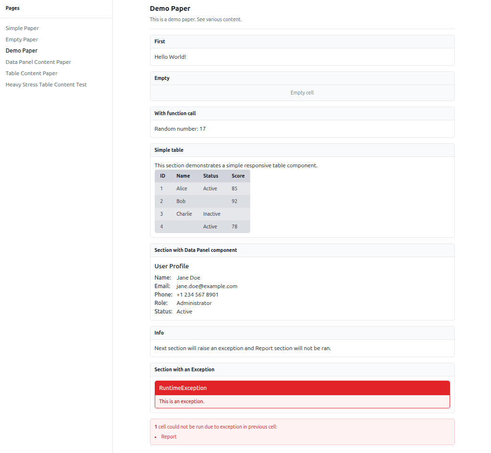

# Laravel Papers

> ⚠️ **Experimental Package — Use With Caution**
>
> Laravel Papers is still in **early development** and considered experimental. While it is functional and may be used in production environments, please be aware of the following:
>
> - The API is **not stable** and may change significantly in upcoming releases.
> - Documentation may be incomplete or subject to improvement.
> - Backward compatibility between minor versions is **not guaranteed**.
> - Use at your own risk — review the source code and test thoroughly before deploying in critical systems.
>
> Feedback, issues, and contributions are very welcome as the package evolves. If you're using it in production, consider locking to a specific version.

[](https://packagist.org/packages/schrojf/laravel-papers)
[](https://github.com/schrojf/laravel-papers/actions?query=workflow%3Arun-tests+branch%3Amain)
[](https://github.com/schrojf/laravel-papers/actions?query=workflow%3A"Fix+PHP+code+style+issues"+branch%3Amain)
[](https://packagist.org/packages/schrojf/laravel-papers)

**Laravel Papers** is a lightweight and flexible package for building and displaying custom debug or reporting pages — called *Papers* — within your Laravel application. Each Paper can aggregate and display structured or unstructured data from various sources such as databases, services, or internal logic.

Originally created as an experimental project, **Laravel Papers** is ideal for internal tools, dashboards, and developer-oriented views that are simple to register and use.



## Features

- Create dynamic reporting pages using reusable components
- Render structured data using tables and data panels
- Secure access using Laravel's Gate authorization

## Requirements

- Laravel Framework 9.x, 10.x, 11.x, or 12.x
- PHP version 8.2, 8.3 or 8.4
- Modern web browser

## Installation

Install the package via Composer:

```bash
composer require schrojf/laravel-papers
```

Publish the configuration file (optional):

```bash
php artisan vendor:publish --tag="papers-config"
```

This is the default `config/papers.php` file:

```php
return [

    'middleware' => [
        'web',
        \Schrojf\Papers\Http\Middleware\AuthorizePapers::class,
    ],

    'api_middleware' => [
        'api',
        \Schrojf\Papers\Http\Middleware\AuthorizePapers::class,
    ],

];
```

Publish the views (optional):

```bash
php artisan vendor:publish --tag="papers-views"
```

## Usage

### Registering Papers

Define and register your Paper classes in a service provider, such as `AppServiceProvider.php`:

```php
use Schrojf\Papers\Papers;
use App\Papers\MyReportPaper;

public function boot(): void
{
    Papers::register([
        MyReportPaper::class,
    ]);
}
```

### Access Control

By default, access to Papers is restricted in non-local environments. Define a Gate to control who can view them:

```php
use Illuminate\Support\Facades\Gate;
use App\Models\User;

public function boot(): void
{
    Gate::define('viewPapers', function (User $user) {
        return in_array($user->email, [
            'admin@example.com',
        ]);
    });
}
```

## Creating a Paper

A Paper class extends `Schrojf\Papers\Paper` and defines its sections as callable functions. Each section returns content such as strings, arrays, or component instances like `TableContent` or `DataPanelContent`.

Here’s a full example:

```php
<?php

namespace App\Papers;

use RuntimeException;
use Schrojf\Papers\Contents\DataPanelContent;
use Schrojf\Papers\Contents\TableContent;
use Schrojf\Papers\Paper;

class DemoPaper extends Paper
{
    public static $description = 'This is a demo paper showing various content types.';
    
    public function sections(): array
    {
        return [
        
            'Simple Text' => fn () => ['Hello', 'World!'],

            'Empty' => function () {
                return null;
            },

            'With function call' => function () {
                $rand = rand(1, 100);

                return 'Random number: ' . $rand;
            },

            'Table Example' => fn () => [
                'This section demonstrates a responsive table.',
                TableContent::withHeaders(['ID', 'Name', 'Status', 'Score'])
                    ->row([1, 'Alice', 'Active', 85])
                    ->row([2, 'Bob', null, 92])
                    ->row([3, 'Charlie', 'Inactive', null])
                    ->row([4, null, 'Active', 78]),
            ],

            'Section with Data Panel Component' => function () {
                return DataPanelContent::make()
                    ->title('User Profile')
                    ->item('Name', 'Jane Doe')
                    ->item('Email', 'jane.doe@example.com')
                    ->item('Phone', '+1 234 567 8901')
                    ->item('Role', 'Administrator')
                    ->item('Status', 'Active');
            },

            'Info' => function () {
                return 'Next section will raise an exception and the Report section will not be run.';
            },

            'Exception Demo' => function () {
                throw new RuntimeException('This is a simulated error.');
            },

            'Unreachable Section' => fn () => 'This will not be rendered if the previous section fails.',
            
        ];
    }
}
```

## Testing

Run the test suite using:

```bash
composer test
```

## Changelog

See [CHANGELOG.md](CHANGELOG.md) for a list of recent changes.

## Contributing

Contributions are welcome! Please see [CONTRIBUTING.md](CONTRIBUTING.md) for guidelines.

## Security Vulnerabilities

If you discover a security vulnerability, please review [our security policy](SECURITY.md) for how to responsibly report it.

## Credits

- [Viliam Schrojf](https://github.com/schrojf)
- [All Contributors](../../contributors)

## License

This package is open-sourced software licensed under the [MIT license](LICENSE.md).
